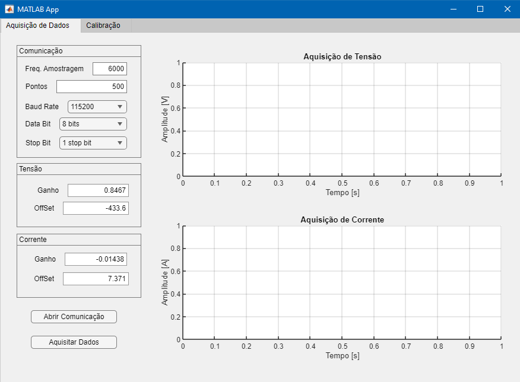

# Signal Aquisition

A project integrating Arduino and MATLAB for data acquisition and analysis.

## Overview

This project combines Arduino and MATLAB to facilitate data acquisition, processing, and visualization. The Arduino board is used to gather data from sensors, and MATLAB provides a user-friendly interface for configuring, acquiring, and analyzing data. This README provides an overview of the project, setup instructions, usage guidelines, and important information for contributors.

## Components

- Arduino board with appropriate sensors (e.g., voltage and current sensors).
- MATLAB software (R2019b or later).
- A computer with a COM port for Arduino communication.

## Directory Structure

- `ATMega328P/`: Contains Arduino code for data acquisition.
- `Matlab/`: Contains the MATLAB application for data visualization and control.

## Getting Started

### ATMega328P Setup

1. Upload the ATMega328P code (`ATMega328P/`) to your board. This code should be designed to interface with your specific sensors and data acquisition needs.

2. Ensure your ATMega328P is properly connected to your computer via USB.

### MATLAB Setup

1. Launch MATLAB on your computer.

2. Create an instance of the `AquisitionApp` class using MATLAB. Sample code can be found in `Matlab/codeRunner.m`.

## Usage

1. Open the MATLAB application (`Matlab/`) and configure your communication settings (baud rate, data bits, and stop bits).

2. Establish a connection to the Arduino board using the "Abrir Comunicação" button.

3. Set the desired sampling parameters, such as sampling rate and the number of data points.

4. Click the "Aquisitar Dados" button to initiate data acquisition. Real-time voltage and current data will be displayed on the plots.

5. Click the "Fechar Comunicação" button to close the communication with the Arduino board when done.

## License

This project is open source and is licensed under the MIT License. Feel free to use, modify, and distribute the code in compliance with the license terms.

## Credits

- Author: Alailton Alves
- Email: alailtonjunior@ufu.br

